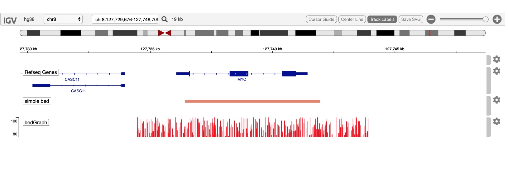

# Introduction: a simple demo

## Overview

The igvR package provides easy programmatic access in R to the web-based
javascript library [igv.js](https://github.com/igvteam/igv.js) to create
and display genome tracks in its richly interactive web browser visual
interface.

In this vignette we present a few very simple uses of igvR:

- connect to the web browser
- query the names (e.g., “mm10”) of the currently supported genoems
- specify that we will use the hg38 genome
- zoom to the MYC gene
- construct a simple data.frame specifying a bed-like track
- display that data.frame track in the browser using a random color
- create and display a “quantitative” data.frame
- zoom out for a wider view

Your display will look like this at the conclusion of this demo:



## Load the libraries we need

``` r

library(igvR)
```

Create the igvR instance, with all default parameters (portRange, quiet,
title). Javascript and HTML is loaded into your browser, igv.js is
initialized, a websocket connection between your R process and that web
page is constructed, over which subsequent commands and data will
travel.

``` r

igv <- igvR()
setBrowserWindowTitle(igv, "simple igvR demo")
setGenome(igv, "hg38")
```

## Display a list of the currently supported genomes

``` r

print(getSupportedGenomes(igv))
```

## Display MYC

``` r

showGenomicRegion(igv, "MYC")
```

## Create and display minimal 1-row data.frame centered below MYC on chr8

``` r

loc <- getGenomicRegion(igv)

tbl.bed <- data.frame(chrom=loc$chrom, start=loc$start + 2000, end=loc$end-2000,
                      name="simple.example", stringsAsFactors=FALSE)

track <- DataFrameAnnotationTrack("simple bed", tbl.bed, color="random")
displayTrack(igv, track)
```

## Create and display a simulated quantitative (bedGraph) track

``` r

loc <- getGenomicRegion(igv)
size <- with(loc, 1 + end - start)
starts <- seq(loc$start, loc$end, by=5)
ends   <- starts + 5
values <- sample(1:100, size=length(starts), replace=TRUE)

tbl.bedGraph <- data.frame(chrom=rep("chr8", length(starts)), start=starts, end=ends,
                           value=values, stringsAsFactors=FALSE)

track <- DataFrameQuantitativeTrack("bedGraph", tbl.bedGraph, color="red", autoscale=FALSE,
                                    min=80, max=100)
displayTrack(igv, track)
```

## Zoom out by direct manipulation of the currently displayed region

``` r

loc <- getGenomicRegion(igv)
half.span <- round((loc$end-loc$start)/2)

new.region <- with(loc, sprintf("%s:%d-%d", chrom, start-half.span, end+half.span))
showGenomicRegion(igv, new.region)
```

## Zoom out and by function calls

``` r


zoomOut(igv)
zoomIn(igv)
```

## Session Info

``` r

sessionInfo()
```
