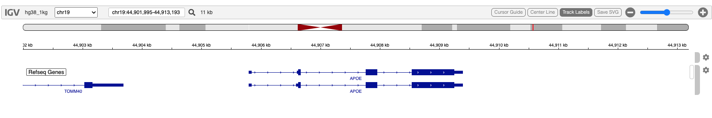

# Use a Stock Genome

## Overview

[igv.org](https://igv.org/) currently (July 2022) provides 35 common and
model organism annotated genomes. Each of these is easily specified and
used in igvR

When igvR is initialized communication is established between your R
session and your default web browser. Then, in a separate function call,
you specifies the genome of interest. igvR then renders the genome
browser view and interactive navigation can begin.

## Demonstration

``` r

library(igvR)
igv <- igvR()
setBrowserWindowTitle(igv, "Stock Genomes")
print(sort(getSupportedGenomes(igv)))
```

    ASM294v2 ASM985889v3  bosTau8 bosTau9  canFam3 canFam5  ce11 chm13v1.1
    chm13v2.0 danRer10 danRer11 dm3  dm6 dmel_r5.9 galGal6 GCA_003086295.2
    gorGor4 gorGor6 hg18 hg19 hg38  hg38_1kg macFas5 mm10 mm39 mm9 panPan2
    panTro4 panTro5 panTro6 rn6 rn7 sacCer3 susScr11 tair10

``` r

setGenome(igv, "hg38_1Kg")
showGenomicRegion(igv, "APOE")
zoomOut(igv)
```

## Display



## Session Info

``` r

sessionInfo()
#> R version 4.5.2 (2025-10-31)
#> Platform: x86_64-pc-linux-gnu
#> Running under: Ubuntu 24.04.3 LTS
#> 
#> Matrix products: default
#> BLAS:   /usr/lib/x86_64-linux-gnu/openblas-pthread/libblas.so.3 
#> LAPACK: /usr/lib/x86_64-linux-gnu/openblas-pthread/libopenblasp-r0.3.26.so;  LAPACK version 3.12.0
#> 
#> locale:
#>  [1] LC_CTYPE=en_US.UTF-8       LC_NUMERIC=C               LC_TIME=en_US.UTF-8        LC_COLLATE=en_US.UTF-8    
#>  [5] LC_MONETARY=en_US.UTF-8    LC_MESSAGES=en_US.UTF-8    LC_PAPER=en_US.UTF-8       LC_NAME=C                 
#>  [9] LC_ADDRESS=C               LC_TELEPHONE=C             LC_MEASUREMENT=en_US.UTF-8 LC_IDENTIFICATION=C       
#> 
#> time zone: UTC
#> tzcode source: system (glibc)
#> 
#> attached base packages:
#> [1] stats     graphics  grDevices utils     datasets  methods   base     
#> 
#> other attached packages:
#> [1] BiocStyle_2.38.0
#> 
#> loaded via a namespace (and not attached):
#>  [1] digest_0.6.39       desc_1.4.3          R6_2.6.1            bookdown_0.46       fastmap_1.2.0      
#>  [6] xfun_0.57           cachem_1.1.0        knitr_1.51          htmltools_0.5.9     rmarkdown_2.31     
#> [11] lifecycle_1.0.5     cli_3.6.6           sass_0.4.10         pkgdown_2.2.0       textshaping_1.0.5  
#> [16] jquerylib_0.1.4     systemfonts_1.3.2   compiler_4.5.2      tools_4.5.2         ragg_1.5.2         
#> [21] bslib_0.10.0        evaluate_1.0.5      yaml_2.3.12         BiocManager_1.30.27 otel_0.2.0         
#> [26] jsonlite_2.0.0      rlang_1.2.0         fs_2.1.0            htmlwidgets_1.6.4
```
