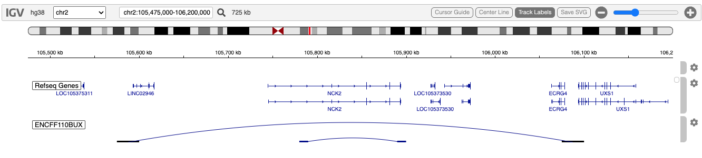

# Paired-end Interaction Tracks

## Overview

With the popularity and wide availability of
[Hi-C](https://en.wikipedia.org/wiki/Hi-C_(genomic_analysis_technique))
data - a high throughput chromatin confirmation capture technology - an
appropriate display format was needed. The igv.js team created the
[Interact](https://github.com/igvteam/igv.js/wiki/Interact) track,
supporint the
[bedpe](https://bedtools.readthedocs.io/en/latest/content/general-usage.html#bedpe-format)
data file format.

## Example

We demonstrate this track with a few lines extracted from the Encode
project’s
[ENCFF110BUX](https://www.encodeproject.org/search/?type=Experiment&searchTerm=ENCFF110BUX)
experiment, from Michael Snyder’s lab, showing the boundaries and extent
of two topologically-associated domains (TADS), typically small genomic
regions which are somewhat isolated from neighboring regions, which is
believed to play a role in restricting enhancer/promoter interactions.

An equally important, and perhaps more common use of paired-end
interaction data is to represent Hi-C maps of enhancer-promoter
interactions. These data also rely upon the *bedpe* file format.

igv.js provides several visualization parameters not yet supported in
igvR.

To define a TAD, two genomic locations are required, as shown here and
in the code below:

          chrom1    start1      end1 chrom2    start2      end2
               2 105780000 105790000      2 105890000 105900000
               2 105575000 105600000      2 106075000 106100000

## Code

These few lines provide a complete, if minimal introduction to the
*BedpeInteractionsTrack*.

``` r

library(igvR)
igv <- igvR()
setBrowserWindowTitle(igv, "Paired-end demo")
setGenome(igv, "hg38")
tbl.bedpe <- data.frame(chrom1 = c("2", "2"),
                        start1 = c(105780000, 105575000),
                        end1 = c(105790000, 105600000),
                        chrom2 = c("2", "2"),
                        start2 = c(105890000, 106075000),
                        end2 = c(105900000, 106100000),
                        stringsAsFactors = FALSE)

  # construct a "region of interest" (roi) string from tbl.bedpe
  # this is where our two features are found.

shoulder <- 300000
roi <- sprintf("%s:%d-%d", tbl.bedpe$chrom1[1],
                           min(tbl.bedpe$start1) - shoulder,
                           max(tbl.bedpe$end2) + shoulder)

showGenomicRegion(igv, roi)
track <- BedpeInteractionsTrack("ENCFF110BUX", tbl.bedpe)
displayTrack(igv, track)
```

## Display



## Session Info

``` r

sessionInfo()
#> R version 4.5.2 (2025-10-31)
#> Platform: x86_64-pc-linux-gnu
#> Running under: Ubuntu 24.04.3 LTS
#> 
#> Matrix products: default
#> BLAS:   /usr/lib/x86_64-linux-gnu/openblas-pthread/libblas.so.3 
#> LAPACK: /usr/lib/x86_64-linux-gnu/openblas-pthread/libopenblasp-r0.3.26.so;  LAPACK version 3.12.0
#> 
#> locale:
#>  [1] LC_CTYPE=en_US.UTF-8       LC_NUMERIC=C               LC_TIME=en_US.UTF-8        LC_COLLATE=en_US.UTF-8    
#>  [5] LC_MONETARY=en_US.UTF-8    LC_MESSAGES=en_US.UTF-8    LC_PAPER=en_US.UTF-8       LC_NAME=C                 
#>  [9] LC_ADDRESS=C               LC_TELEPHONE=C             LC_MEASUREMENT=en_US.UTF-8 LC_IDENTIFICATION=C       
#> 
#> time zone: UTC
#> tzcode source: system (glibc)
#> 
#> attached base packages:
#> [1] stats     graphics  grDevices utils     datasets  methods   base     
#> 
#> other attached packages:
#> [1] BiocStyle_2.38.0
#> 
#> loaded via a namespace (and not attached):
#>  [1] digest_0.6.39       desc_1.4.3          R6_2.6.1            bookdown_0.46       fastmap_1.2.0      
#>  [6] xfun_0.57           cachem_1.1.0        knitr_1.51          htmltools_0.5.9     rmarkdown_2.31     
#> [11] lifecycle_1.0.5     cli_3.6.6           sass_0.4.10         pkgdown_2.2.0       textshaping_1.0.5  
#> [16] jquerylib_0.1.4     systemfonts_1.3.2   compiler_4.5.2      tools_4.5.2         ragg_1.5.2         
#> [21] bslib_0.10.0        evaluate_1.0.5      yaml_2.3.12         BiocManager_1.30.27 otel_0.2.0         
#> [26] jsonlite_2.0.0      rlang_1.2.0         fs_2.1.0            htmlwidgets_1.6.4
```
