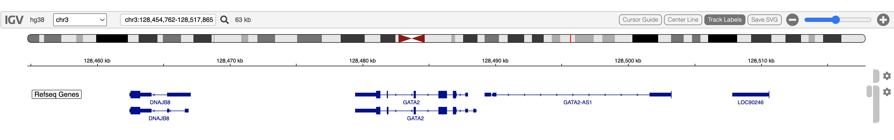
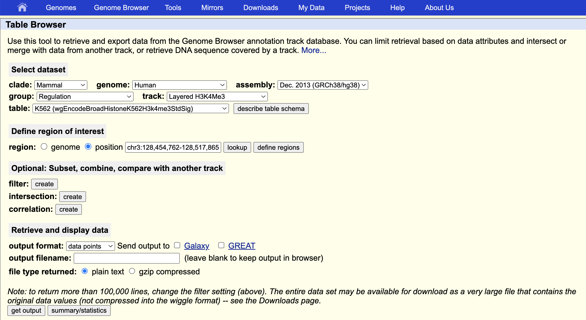
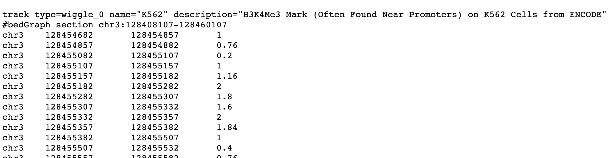
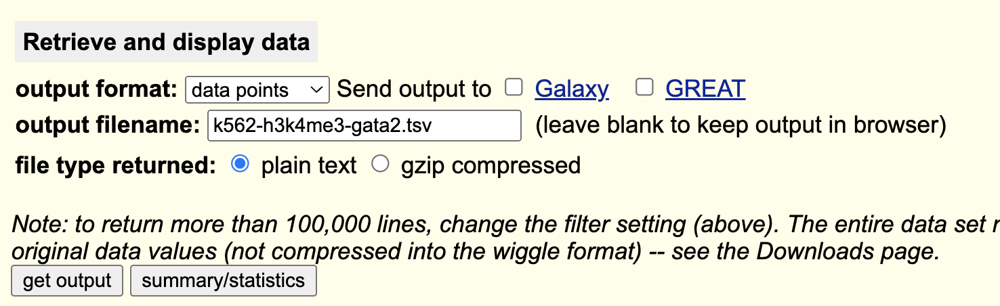
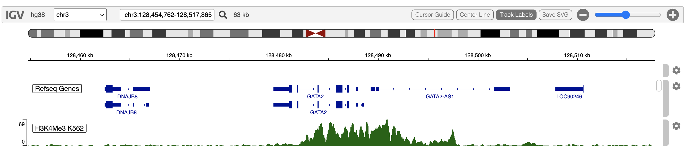

# Obtain and Display H3K4Me3 K562 track from UCSC table browser

## Overview

The UCSC Table Browser is a good source of genomic annotations of many
different kinds. It has a clear, easily navigated user interface. It is
a good complement to igvR.

The H3K4Me3 post-translational modification is frequently found in
active promoters near transcription start sites. Here we obtain H3K4Me3
methylation marks in K562 cells in and around GATA2.

These are the steps involved:

1.  in igvR, display a genomic region of interest
2.  use your mouse to copy the resulting **chrom:start-end** genomic
    region string
3.  in the Table Browser, select your genome and dataset of interest
4.  paste the genomic region string into the UCSC Table Browser
5.  click **get output** to examine the specified data
6.  once you are satisfied that the data are of interest, fill in the
    **output filename** and save to a local tsv file
7.  back in R, use read.table to create a data.frame from that file
8.  construct and display an igvR DataFrameAnnotationTrack or
    DataFrameQuantitativeTrack

All these steps are shown below.

## Display a genomic region of interest in igvR

``` r

library(igvR)
igv <- igvR()
setBrowserWindowTitle(igv, "H3K4Me3 GATA2")
setGenome(igv, "hg38")
showGenomicRegion(igv, "GATA2")
zoomOut(igv)
zoomOut(igv)
```



## Obtain the coordinates

``` r

getGenomicRegion(igv)
```

    $chrom
    [1] "chr3"

    $start
    [1] 128454762

    $end
    [1] 128517865

    $width
    [1] 63104

    $string
    [1] "chr3:128,454,762-128,517,865"

## Navigate the Table Browser

Use this URL: **<https://genome.ucsc.edu/cgi-bin/hgTables>**

Copy and past the region string into the UCSC Table Browser **position**
field. Make other selections as shown.



## Examine the Data

With the **output filename** blank, the **get output** button shows you
the selected data as text in your web browser:



## Download the Data

Return to the previous UCSC Table Browser Screen, fill in a download
filename, click **get output**



## Read the data into R

``` r

tbl <- read.table("~/drop/k562-h3k4me3-gata2.tsv", sep = "\t", skip = 1, as.is = TRUE, fill = TRUE)
colnames(tbl) <- c("chrom", "start", "end", "score")
```

Make sure the column classes are as expected:

``` r

lapply(tbl, class)
```

    $chrom
    [1] "character"

    $start
    [1] "integer"

    $end
    [1] "integer"

    $score
    [1] "numeric"

## Create and Display a Quantitative Track

``` r

track <- DataFrameQuantitativeTrack("H3K4Me3 K562", tbl, autoscale = TRUE, color = "darkGreen")
displayTrack(igv, track)
```



## Session Info

``` r

sessionInfo()
#> R version 4.5.2 (2025-10-31)
#> Platform: x86_64-pc-linux-gnu
#> Running under: Ubuntu 24.04.3 LTS
#> 
#> Matrix products: default
#> BLAS:   /usr/lib/x86_64-linux-gnu/openblas-pthread/libblas.so.3 
#> LAPACK: /usr/lib/x86_64-linux-gnu/openblas-pthread/libopenblasp-r0.3.26.so;  LAPACK version 3.12.0
#> 
#> locale:
#>  [1] LC_CTYPE=en_US.UTF-8       LC_NUMERIC=C               LC_TIME=en_US.UTF-8        LC_COLLATE=en_US.UTF-8    
#>  [5] LC_MONETARY=en_US.UTF-8    LC_MESSAGES=en_US.UTF-8    LC_PAPER=en_US.UTF-8       LC_NAME=C                 
#>  [9] LC_ADDRESS=C               LC_TELEPHONE=C             LC_MEASUREMENT=en_US.UTF-8 LC_IDENTIFICATION=C       
#> 
#> time zone: UTC
#> tzcode source: system (glibc)
#> 
#> attached base packages:
#> [1] stats     graphics  grDevices utils     datasets  methods   base     
#> 
#> other attached packages:
#> [1] BiocStyle_2.38.0
#> 
#> loaded via a namespace (and not attached):
#>  [1] digest_0.6.39       desc_1.4.3          R6_2.6.1            bookdown_0.46       fastmap_1.2.0      
#>  [6] xfun_0.57           cachem_1.1.0        knitr_1.51          htmltools_0.5.9     rmarkdown_2.31     
#> [11] lifecycle_1.0.5     cli_3.6.6           sass_0.4.10         pkgdown_2.2.0       textshaping_1.0.5  
#> [16] jquerylib_0.1.4     systemfonts_1.3.2   compiler_4.5.2      tools_4.5.2         ragg_1.5.2         
#> [21] bslib_0.10.0        evaluate_1.0.5      yaml_2.3.12         BiocManager_1.30.27 otel_0.2.0         
#> [26] jsonlite_2.0.0      rlang_1.2.0         fs_2.1.0            htmlwidgets_1.6.4
```
