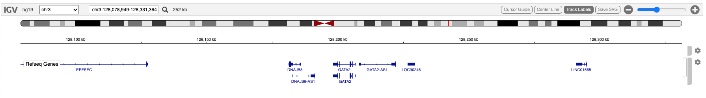
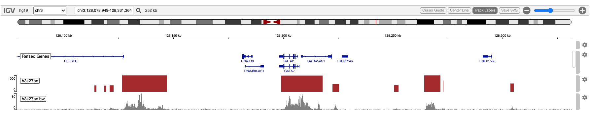

# Obtain and Display H3K27ac K562 track from the AnnotationHub

## Overview

The Bioconductor AnnotationHub is a good source of genomic annotations
of many different kinds.

H3K27ac is an epigenetic modification to the histone H3, an acetylation
of the lysine residue at N-terminal position 27. H3K27ac is [associated
with active
enhancers](https://www.pnas.org/doi/10.1073/pnas.1016071107).

To the best of my knowledge, fetching data from the AnnotationHub does
not support regions. The fetch is necessarily of the entire genomic
resource - all chromosomes - and so may require time-consuming
downloads. Subsetting by region takes place **after** the often
time-consuming download.

Therefore, to run this vignette for the first time may take up to 20
minutes due to that download time.

Once downloaded, however, the resource is cached.

## Display a genomic region of interest in igvR

``` r

library(igvR)
library(AnnotationHub)

igv <- igvR()
setBrowserWindowTitle(igv, "H3K27ac GATA2")
setGenome(igv, "hg19")
showGenomicRegion(igv, "GATA2")
for (i in 1:4) zoomOut(igv)
```



## Query the AnnotationHub

``` r

aHub <- AnnotationHub()
query.terms <- c("H3K27Ac", "k562")
length(query(aHub, query.terms)) # found 7
h3k27ac.entries <- query(aHub, query.terms)
```

The available data, key and title:

      AH23388 | wgEncodeBroadHistoneK562H3k27acStdPk.broadPeak.gz
      AH29788 | E123-H3K27ac.broadPeak.gz
      AH30836 | E123-H3K27ac.narrowPeak.gz
      AH31772 | E123-H3K27ac.gappedPeak.gz
      AH32958 | E123-H3K27ac.fc.signal.bigwig
      AH33990 | E123-H3K27ac.pval.signal.bigwig
      AH39539 | E123-H3K27ac.imputed.pval.signal.bigwig

## Select Two Resources: boadPeaks and fc bigwig

If not in your cache, this step may take 20 minutes.

``` r

x.broadPeak <- aHub[["AH23388"]]
x.bigWig <- aHub[["AH32958"]]
```

The two resources are different data types, requiring different
processing to render as tracks in igvR

- **x.broadPeak** is a GRanges object in memory
- **x.bigWig** is a bigwig file in your cache

## broadPeaks: subset and display

The broadPeak data is a GRanges object already in memory. Subset to
obtain only the 252 kb region in which we are interested.

``` r

roi <- getGenomicRegion(igv)
gr.broadpeak <- x.broadPeak[seqnames(x.broadpeak) == roi$chrom &
                            start(x.broadpeak) > roi$start &
                            end(x.broadpeak) < roi$end]
```

igvR’s **GrangesQuantitativeTrack** must have only one numeric column in
the GRanges metadata. That column is used as the magnitudes the track
will display.

``` r

names(mcols(gr.broadpeak))
  #  "name"        "score"       "signalValue" "pValue"      "qValue"
mcols(gr.broadpeak) <- gr.broadpeak$score
track <- GRangesQuantitativeTrack("h3k27ac bp", gr.broadpeak, autoscale = TRUE, color = "brown")
displayTrack(igv, track)
```

## bigWig: subset and display

We use the import function from the **rtracklayer** package to read in
only a small portion of the large bigWig file. Note that, as read, there
is only one numeric metadata colum, “score”, so no reduction of mcols is
needed.

``` r

file.bigWig <- resource(x.bigWig)[[1]]
gr.roi <- with(roi, GRanges(seqnames = chrom, IRanges(start, end)))
gr.bw <- import(file.bigWig, which = gr.roi, format = "bigWig")
track <- GRangesQuantitativeTrack("h3k27ac.bw", gr.bw, autoscale = TRUE, color = "gray")
displayTrack(igv, track)
```



## Session Info

``` r

sessionInfo()
#> R version 4.5.2 (2025-10-31)
#> Platform: x86_64-pc-linux-gnu
#> Running under: Ubuntu 24.04.3 LTS
#> 
#> Matrix products: default
#> BLAS:   /usr/lib/x86_64-linux-gnu/openblas-pthread/libblas.so.3 
#> LAPACK: /usr/lib/x86_64-linux-gnu/openblas-pthread/libopenblasp-r0.3.26.so;  LAPACK version 3.12.0
#> 
#> locale:
#>  [1] LC_CTYPE=en_US.UTF-8       LC_NUMERIC=C               LC_TIME=en_US.UTF-8        LC_COLLATE=en_US.UTF-8    
#>  [5] LC_MONETARY=en_US.UTF-8    LC_MESSAGES=en_US.UTF-8    LC_PAPER=en_US.UTF-8       LC_NAME=C                 
#>  [9] LC_ADDRESS=C               LC_TELEPHONE=C             LC_MEASUREMENT=en_US.UTF-8 LC_IDENTIFICATION=C       
#> 
#> time zone: UTC
#> tzcode source: system (glibc)
#> 
#> attached base packages:
#> [1] stats     graphics  grDevices utils     datasets  methods   base     
#> 
#> other attached packages:
#> [1] BiocStyle_2.38.0
#> 
#> loaded via a namespace (and not attached):
#>  [1] digest_0.6.39       desc_1.4.3          R6_2.6.1            bookdown_0.46       fastmap_1.2.0      
#>  [6] xfun_0.57           cachem_1.1.0        knitr_1.51          htmltools_0.5.9     rmarkdown_2.31     
#> [11] lifecycle_1.0.5     cli_3.6.6           sass_0.4.10         pkgdown_2.2.0       textshaping_1.0.5  
#> [16] jquerylib_0.1.4     systemfonts_1.3.2   compiler_4.5.2      tools_4.5.2         ragg_1.5.2         
#> [21] bslib_0.10.0        evaluate_1.0.5      yaml_2.3.12         BiocManager_1.30.27 otel_0.2.0         
#> [26] jsonlite_2.0.0      rlang_1.2.0         fs_2.1.0            htmlwidgets_1.6.4
```
