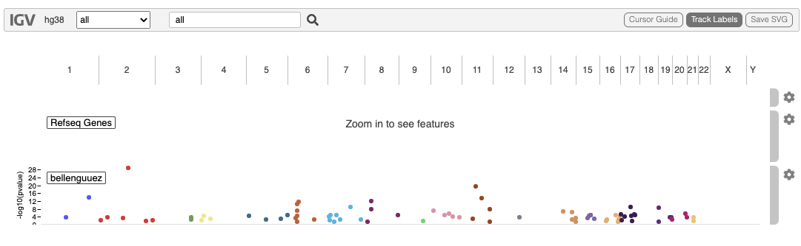
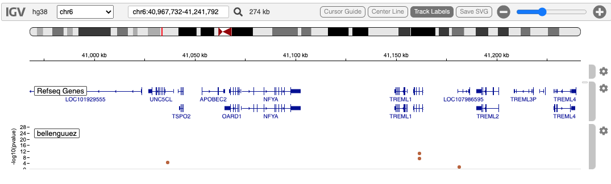
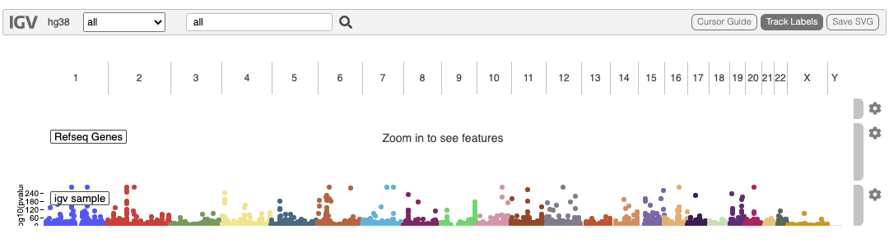
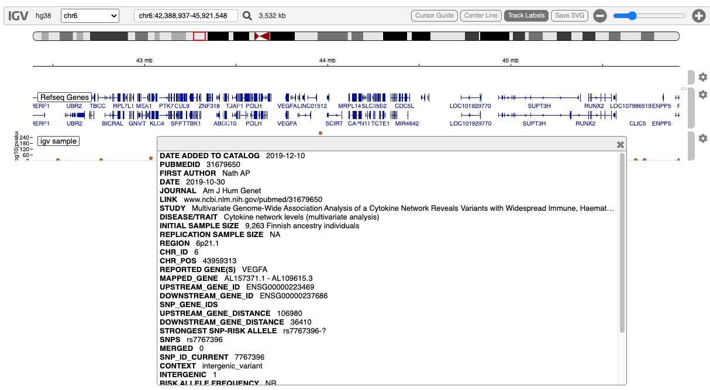

# GWAS Tracks

## Overview

Genome Wide Association Studies (GWAS) are often viewed in a “manhattan
plot”. [igv.js](https://github.com/igvteam/igv.js/wiki/GWAS) supports
thesein two formats: a fixed bed format, and the traditional flexible,
multi-column file format in which GWAS results are often summarized.

We support only the latter since its flexibility can be used with the
five-column fixed bed format as well.

The data from GWAS studies is rather sparse, usually with no more than a
few hundred variant hotspots which associate with the phenotype of
interest. Another feature of these data is that the community is often
most concerned with the statistical significance of the association.
This is expressed as a pvalue. A minus-log10 transform of the pvalue
controls the height of the rendered variant in the manhattant plot.

Support for this track type in igvR is new (summer 2022) and unpolished.
Control of autoscaling and fixed scaling needs work.

There are two relevant classes, shown here with their constructors:

1.  GWASTrack(“bellenguuez”, tbl.gwas, chrom.col=1, pos.col=2,
    pval.col=5, trackHeight=80)
2.  GWASUrlTrack(“igv sample”, url, chrom.col=12, pos.col=13,
    pval.col=28)

All the arguments are the same, except for the second one, which is
either a local data.frame in memory, or a url pointing to a remote file
served over http.

## Demostration: a local data.frame with 5 columns

Here we use a 5-column data.frame from a file hosted in igvR’s extdata,
GWAS results from a 2022 Nature Genetics paper, [New insights into the
genetic etiology of Alzheimer’s disease and related
dementias](https://www.nature.com/articles/s41588-022-01024-z).

Its first few rows:

      chrom     start       end        name    score
    1  chr1 109345809 109345810 rs141749679 2.36e-04
    2  chr1 207577222 207577223    rs679515 1.51e-14
    3  chr2   9558881   9558882  rs72777026 4.14e-03
    4  chr2  37304795  37304796  rs17020490 2.33e-04
    5  chr2 105749598 105749599 rs143080277 6.29e-04
    6  chr2 127135233 127135234   rs6733839 2.06e-30

``` r

library(igvR)
igv <- igvR()
setBrowserWindowTitle(igv, "AD GWAS")
setGenome(igv, "hg38")
tbl.gwas <- read.table(system.file(package="igvR", "extdata", "gwas", "bellenguez.bed"),
                       sep="\t", as.is=TRUE, header=TRUE, nrow=-1)
track <- GWASTrack("bellenguuez", tbl.gwas, chrom.col=1, pos.col=2, pval.col=5, trackHeight=80)
displayTrack(igv, track)
```



Zoomed into the neighborhood of TREM2, a gene independently known to be
associated with Alzheimer’s Disease.



## Demonstration: a remote GWAS file with 34 columns

This file is more typical of that used in GWAS studies. These are the
columns:

1.  DATE ADDED TO CATALOG
2.  PUBMEDID
3.  FIRST AUTHOR
4.  DATE
5.  JOURNAL
6.  LINK
7.  STUDY
8.  DISEASE/TRAIT
9.  INITIAL SAMPLE SIZE
10. REPLICATION SAMPLE SIZE
11. REGION
12. CHR_ID
13. CHR_POS
14. REPORTED GENE(S)
15. MAPPED_GENE
16. UPSTREAM_GENE_ID
17. DOWNSTREAM_GENE_ID
18. SNP_GENE_IDS
19. UPSTREAM_GENE_DISTANCE
20. DOWNSTREAM_GENE_DISTANCE
21. STRONGEST SNP-RISK ALLELE
22. SNPS
23. MERGED
24. SNP_ID_CURRENT
25. CONTEXT
26. INTERGENIC
27. RISK ALLELE FREQUENCY
28. P-VALUE
29. PVALUE_MLOG
30. P-VALUE (TEXT)
31. OR or BETA
32. 95% CI (TEXT)
33. PLATFORM \[SNPS PASSING QC\]
34. CNV

Here we create the track and display it:

``` r

url <- "https://s3.amazonaws.com/igv.org.demo/gwas_sample.tsv.gz"
track <- GWASUrlTrack("igv sample", url,chrom.col=12, pos.col=13, pval.col=28)
displayTrack(igv, track)
```

First, the whole genome view:

 Now, zooin into on chromsome 6, and click on any
variant in the display (here we chose **rs7767396**) the full data from
the multi-column gwas file is available.



## Session Info

``` r

sessionInfo()
#> R version 4.5.2 (2025-10-31)
#> Platform: x86_64-pc-linux-gnu
#> Running under: Ubuntu 24.04.3 LTS
#> 
#> Matrix products: default
#> BLAS:   /usr/lib/x86_64-linux-gnu/openblas-pthread/libblas.so.3 
#> LAPACK: /usr/lib/x86_64-linux-gnu/openblas-pthread/libopenblasp-r0.3.26.so;  LAPACK version 3.12.0
#> 
#> locale:
#>  [1] LC_CTYPE=en_US.UTF-8       LC_NUMERIC=C               LC_TIME=en_US.UTF-8        LC_COLLATE=en_US.UTF-8    
#>  [5] LC_MONETARY=en_US.UTF-8    LC_MESSAGES=en_US.UTF-8    LC_PAPER=en_US.UTF-8       LC_NAME=C                 
#>  [9] LC_ADDRESS=C               LC_TELEPHONE=C             LC_MEASUREMENT=en_US.UTF-8 LC_IDENTIFICATION=C       
#> 
#> time zone: UTC
#> tzcode source: system (glibc)
#> 
#> attached base packages:
#> [1] stats     graphics  grDevices utils     datasets  methods   base     
#> 
#> other attached packages:
#> [1] BiocStyle_2.38.0
#> 
#> loaded via a namespace (and not attached):
#>  [1] digest_0.6.39       desc_1.4.3          R6_2.6.1            bookdown_0.46       fastmap_1.2.0      
#>  [6] xfun_0.57           cachem_1.1.0        knitr_1.51          htmltools_0.5.9     rmarkdown_2.31     
#> [11] lifecycle_1.0.5     cli_3.6.6           sass_0.4.10         pkgdown_2.2.0       textshaping_1.0.5  
#> [16] jquerylib_0.1.4     systemfonts_1.3.2   compiler_4.5.2      tools_4.5.2         ragg_1.5.2         
#> [21] bslib_0.10.0        evaluate_1.0.5      yaml_2.3.12         BiocManager_1.30.27 otel_0.2.0         
#> [26] jsonlite_2.0.0      rlang_1.2.0         fs_2.1.0            htmlwidgets_1.6.4
```
