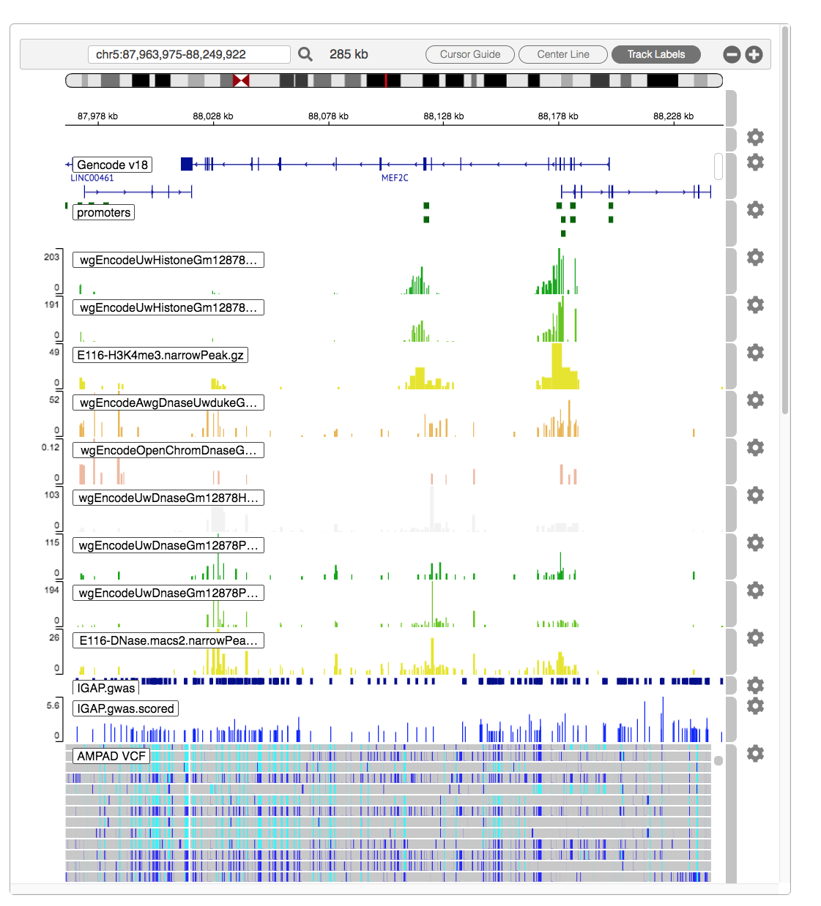

```{r setup, include = FALSE}
knitr::opts_chunk$set(
  collapse = TRUE,
  comment = "#>"
)
```

The IGV package provides simple R methods with which to create and display genome tracks in a richly interactive web browser visual interface.  provides Vignettes are long form documentation commonly included in packages.

Here is a rather complete example to illustrate the use of the package in integration with some of Bioconductor's data acquisition (AnnotationHub) as well as large-file subsetting tools from the VariantAnnotation package.  Individual commands are discussed below.   

This example is not entirely a toy.  We explore non-coding variants reported in a 2013 paper, "Meta-analysis of 74,046 individuals identifies 11 new susceptibility loci for Alzheimer's disease" [Lambert et al, Nature genetics. 2013;45(12):1452-1458]  This analysis brings the total count of susceptibility loci to 20, which includes 1MB surrounding the MEF2C gene.  We conjecture that among these non-coding variants are some which affect regulation, perhaps via disruption of transcription factor binding sites.   H3K4me3 methylation and DNAse hypersensitivity regions identify plausible regions in which TFs may bind.  Using the well-studied Gm12878 lymphoblastoid cell line as our proxy for brain cells, we obtain three methylation tracks, and six DNAse tracks, which are largely consistent with transcript-specific predicted promoter regions, 2kb upstream, 200bp downstream from transcript TSS.   (A deeper analysis can be pursued with DNAse footprint data offered by the trena package, along with TF motif matching and and linear models of TF/target gene expression.)  Variants from 540? Alzheimer's patients from the AMPAD project are included for rough comparison, and to demonstrate the use of IGV with large variant (VCF) files.

```{r, out.width="800px", include=TRUE, echo=FALSE}

```

- Never uses retina figures
- Has a smaller default figure size
- Uses a custom CSS stylesheet instead of the default Twitter Bootstrap style

## Vignette Info

Note the various macros within the `vignette` section of the metadata block above. These are required in order to instruct R how to build the vignette. Note that you should change the `title` field and the `\VignetteIndexEntry` to match the title of your vignette.

## Styles

The `html_vignette` template includes a basic CSS theme. To override this theme you can specify your own CSS in the document metadata as follows:

    output: 
      rmarkdown::html_vignette:
        css: mystyles.css

## Figures

The figure sizes have been customised so that you can easily put two images side-by-side. 

```{r, fig.show='hold'}
plot(1:10)
plot(10:1)
```

You can enable figure captions by `fig_caption: yes` in YAML:

    output:
      rmarkdown::html_vignette:
        fig_caption: yes

Then you can use the chunk option `fig.cap = "Your figure caption."` in **knitr**.

## More Examples

You can write math expressions, e.g. $Y = X\beta + \epsilon$, footnotes^[A footnote here.], and tables, e.g. using `knitr::kable()`.

```{r, echo=FALSE, results='asis'}
knitr::kable(head(mtcars, 10))
```

Also a quote using `>`:

> "He who gives up [code] safety for [code] speed deserves neither."
([via](https://twitter.com/hadleywickham/status/504368538874703872))
