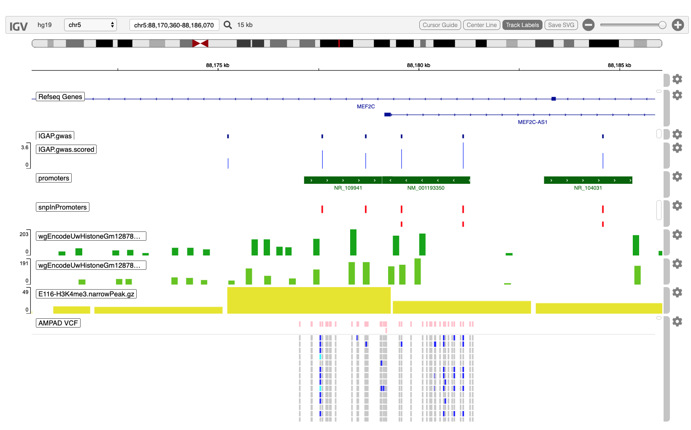

<style>
.main-container { width: 1200px; max-width:2800px;}
</style>


```{r setup, include = FALSE}
options(width=120)
knitr::opts_chunk$set(
   collapse = TRUE,
   eval=interactive(),
   echo=TRUE,
   comment = "#>"
)
```


# Overview

The igvR package provides easy programmic access in R to the web-based javascript library
[igv.js](https://github.com/igvteam/igv.js) in order to create and display genome tracks in its richly
interactive web browser visual interface.  I am grateful to Jim Robinson, Douglass Turner and
colleagues for their fine work.

We introduce igvR via a case study of genetic variants associated with Alzheimer's Disease as
described in the 2014 Nature Genetics paper

  &nbsp; &nbsp; &nbsp; *Meta-analysis of 74,046 individuals identifies 11 new susceptibility loci for Alzheimer’s disease*^1^

Theses 11 loci bring the total susceptibility loci count to 20, of which MEF2C is one. We focus on a 1 megabase region surrounding the MEF2C gene which contains 208 variants whose presence is associated with the
expression of MEF2C in 17,008 Alzheimer's disease cases and 37,154 controls.  Interestingly, these
variants do not occur in coding regions of the gene.  Some possible insight into their function --
of a highly speculative and preliminary sort - is provided by this case study.  We pursue the
question: could these non-coding variants alter MEF2C gene regulation by disrupting transcription
factor binding sites?


We will proceed as follows:

 - load the igvR package

 - connect to the igv.js genome browser

 - set the reference genome (hg19)

 - zoom into the MEF2C region

 - expand to display the entire 1MB region of interest

 - create our first track - the 208 SNPs - using the most primitive approach: from a base R data.frame

 - employ Bioconductor's AnnotationHub to retrieve three methylation datasets - which are associated
    with open chromatin and transcription factor binding sites.
    From each of these datasets we create an igvR track of an approriate type - igvR's Track class
    has a variety of subclasses depending on data type and data source location.  Annotation, Quantitative
    and Variant tracks are supported here in this first (1.0) version of igvR.

 - for good measure we conclude by loading a very small slice of a different variant dataset,
   in VCF format, from another   Alzheimer's [study](http://adni.loni.usc.edu/data-samples/genetic-data/wgs/)
   of 818 participants.  VCF files typically contain fine-grained variant data, as is seen in the igv.js
   popup dialog.

The result from running the code below:

```{r, eval=TRUE, echo=FALSE}



# Load the libraries we need

```{r loadLibraries,  results='hide'}
library(igvR)
library(MotifDb)
library(BSgenome.Hsapiens.UCSC.hg19)
library(VariantAnnotation)
library(AnnotationHub)
```

Create the igvR instance, with all default parameters (portRange, quiet, title).  Javascript and HTML is loaded into
your browser, igv.js is initialized, a websocket connection between your R process and that web page is constructed,
over which subsequent commands and data will travel.

```{r createLoad, results='hide'}
igv <- igvR()
setBrowserWindowTitle(igv, "MEF2C")
setGenome(igv, "hg19")
```
Display MEF2C
```{r showMEF2C,  results='hide'}
showGenomicRegion(igv, "MEF2C")
```

# Expand the region on display, create a GRanges object for subsequent genomic queries

```{r roi,  results='hide'}
loc <- getGenomicRegion(igv)
margin <- 25000
bigger.loc <- with(loc, sprintf("%s:%d-%d", chrom, start-margin, end+margin))
mef2c.region <- with(loc, GRanges(seqnames=chrom, IRanges(start=start+margin, end=end+margin)))
showGenomicRegion(igv, bigger.loc)
```

These next few steps expose the nuts and bolts of creating and displaying tracks from tabular data.
None of the power and convenience of the Biocondcutor AnnotationHub, of rtracklayer and
GenomicRanges is used here - that comes later in the vignette.

Add the IGAP GWAS track twice, first as an annotation track, so that names are avaialble by clicking,
then again as a quantitative track, using a -log10(pValue) score, conveying strength of association
of each SNP with the expression of the target gene, MEF2C, by the height of each SNP's track element.

[IGAP](http://consortiapedia.fastercures.org/consortia/igap/), the International Genomics of Alzheimer's Project, provide these data.  See [Meta-analysis of 74,046 individuals identifies 11 new susceptibility loci for Alzheimer’s disease](https://www.ncbi.nlm.nih.gov/pmc/articles/PMC3896259/), Nature Genetics, Dec 2013.


```{r data.frame.track,  results='hide'}
load(system.file(package="igvR", "extdata", "tbl.mef2cGWAS.variants.RData"))
tbl.mef2cGWAS.variants.bed <- tbl.mef2cGWAS.variants[, c("CHR", "oldPos", "oldPos", "SNP", "P")]
tbl.mef2cGWAS.variants.bed$P <- -log10(tbl.mef2cGWAS.variants.bed$P)
colnames(tbl.mef2cGWAS.variants.bed) <- c("chrom", "start", "end", "name", "score")
track.gwas <- DataFrameAnnotationTrack("IGAP.gwas", tbl.mef2cGWAS.variants.bed, trackHeight=20, color="darkBlue")
displayTrack(igv, track.gwas)

tbl.mef2cGWAS.variants.bedGraph <-  tbl.mef2cGWAS.variants.bed[, -4]
track.gwas.numeric <- DataFrameQuantitativeTrack("IGAP.gwas.scored", tbl.mef2cGWAS.variants.bedGraph, autoscale=TRUE)
displayTrack(igv, track.gwas.numeric)

```
# Use the bioc AnnotationHub to create a promoter track

A location-only calculation is used to identify gene promoters, rather than more nuanced
experimental data, of which we will seem more later in this vignette.  We use default, conservative
parameters (2kb upstream of TSS, 200bp downstream).

```{r queryAHforPromoters,  results='hide'}
ah <- AnnotationHub()
ah.human <- subset(ah, species == "Homo sapiens")
#----------------------------------------------------------------------------------------------------
# add refseq promoters, available from RefSeq for each transcript which has been identified
#----------------------------------------------------------------------------------------------------
ah.human.refseq <- query(ah.human, "RefSeq", "hg19", "RefSeq Genes")

# download the first set
human.refseq <- ah.human.refseq[[1]]
gr.promoters <- promoters(human.refseq, upstream=2000, downstream=200)
  # get rid of score, itemRgb, thick, blocks columns in the mcols, keeping just the transcript name.
  # these attributes are meaningful for transcript tracks since those include the represenation
  # of UTRs, introns and exons.   but a promoter is a stretch of DNA for which those distinctions
  # do not apply
mcols(gr.promoters) <- mcols(gr.promoters)[,1]
colnames(mcols(gr.promoters)) <- "name"
ov <- findOverlaps(gr.promoters, mef2c.region)
gr.mef2c.promoters <- gr.promoters[queryHits(ov)]
track.promoters <- UCSCBedAnnotationTrack("promoters", gr.mef2c.promoters, color="darkGreen")
displayTrack(igv, track.promoters)
```
# Overlap promoters and variants, create new track

Non-coding SNPs which fall in promoter regions are plausible candidates for further examination.
They may disrupt or create a transcription factor binding site, and thus possibly contribute to the
disease under study.

```{r overlapPromotersAndVariants,  results='hide'}
gr.variants <- GRanges(tbl.mef2cGWAS.variants.bed)
ov <- findOverlaps(gr.variants, gr.promoters)
gr.variantsInPromoters <- gr.variants[queryHits(ov)]
track.variantsInPromoters <-GRangesAnnotationTrack("snpInPromoters", gr.variantsInPromoters,
                                                   color="red", displayMode="EXPANDED")
displayTrack(igv, track.variantsInPromoters)
```
# Add Methylation Tracks

H3K4me3 histone methylation marks are often associated with transcription initiation in promoter
regions.  We will add three tracks from the AnnotationHub for H3K4me3 methylation in
[Gm12878](https://www.genome.gov/26524238/encode-project-common-cell-types/) (lymphoblastoid) cells.

```{r methylationTracks,  results='hide'}
histone.tracks <- query(ah.human, c("H3K4me3", "Gm12878", "Peak", "narrow"))  # 3 tracks
descriptions <- histone.tracks$description
titles <- histone.tracks$title
colors <- rep(terrain.colors(6), 4)
color.index <- 0

for(i in seq_len(length(histone.tracks))){
   name <- names(histone.tracks)[i]
   color.index <- color.index + 1
   gr <- histone.tracks[[name]]
   ov <- findOverlaps(gr, mef2c.region)
   mef2c.histones <- gr[queryHits(ov)]
   track.histones <- GRangesQuantitativeTrack(titles[i], mef2c.histones[, "pValue"],
                                              color=colors[color.index], trackHeight=50,
                                              autoscale=TRUE)
   displayTrack(igv, track.histones)
   } # for track

```

# VCF from ADNI, the Alzheimer's Disease Neuroimaging Initiative

We include a very small slice of the ADNI whole genome sequencing
[data](http://adni.loni.usc.edu/data-samples/genetic-data/wgs/).  349 samples (filtered from a
larger set of 128 AD, 415 Mild Cognitive Impairment, 267 controls, 8 uncertains) are included, all
in a ~4kb region including methylation marks, and IGAP GWAS SNPs in promoter regions.

In order to illustrate some of genomic data exploration capabilities of igvR we are therefore mixing
apples and oranges.  We have GWAS variants from IGAP (a very large meta-analysis), promoters from
RefSeq (conservatively defined), methylation marks from a lymphoblastoid cell line, and WGS variants
from ADNI. Note also that the ADNI variants in the VCF track are not stratified by disease
phenotype.  Therefore, examining rsid rs80043958 at chr5:88,179,576 with an IGAP GWAS pvalue of
0.002, we see the ADNI heterozygosity is 0.269 - this and other information about that variant is
displayed in a popup by clicking on the pinkish "anchor block" - keep in mind that that number would
be more informative if broken out by phenotype.

```{r adniVCF,  results='hide'}
vcfFilename <- system.file(package="igvR", "extdata", "mef2c-4kb.vcf")
vcf <- readVcf(vcfFilename, "hg19")
track.vcf <- VariantTrack("AMPAD VCF", vcf, trackHeight=1000)
displayTrack(igv, track.vcf)
showGenomicRegion(igv, "chr5:88,175,901-88,181,613")

```
# References

1. Lambert, Jean-Charles, et al. "Meta-analysis of 74,046 individuals identifies 11 new susceptibility loci for Alzheimer's disease." [Nature genetics 45.12 (2013): 1452](https://www.ncbi.nlm.nih.gov/pubmed/24162737).

```{r sessionInfo}
sessionInfo()
````

