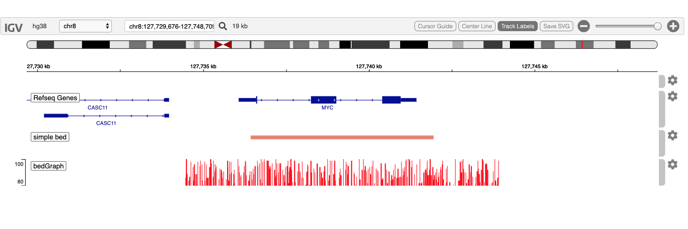

<style>
.main-container { width: 1200px; max-width:2800px;}
</style>


```{r setup, include = FALSE}
options(width=120)
knitr::opts_chunk$set(
   collapse = TRUE,
   eval=interactive(),
   echo=TRUE,
   comment = "#>"
)
```


# Overview

The igvR package provides easy programmic access in R to the web-based javascript library
[igv.js](https://github.com/igvteam/igv.js) in order to create and display genome tracks in its richly
interactive web browser visual interface.  I am grateful to Jim Robinson, Douglass Turner and
colleagues for their fine work.

In this vignette we present the simplest possible use of igvR:

  - connect to the web browser
  - specify that we will use the hg38 genome
  - zoom to the Myc gene
  - construct a simple data.frame specifying a bed-like track
  - display that data.frame track in the browser
  - create and display a "quantitative" data.frame, which is displayed (autoscaled)as a bedGraph track in the browser
  - display that same data.frame with explicit scaling
  - zoom out
    
```{r, eval=TRUE, echo=FALSE}

```

# Load the libraries we need

```{r loadLibraries,  results='hide'}
library(igvR)
```

Create the igvR instance, with all default parameters (portRange, quiet, title).  Javascript and HTML is loaded into
your browser, igv.js is initialized, a websocket connection between your R process and that web page is constructed,
over which subsequent commands and data will travel.

```{r createLoad, results='hide'}
igv <- igvR()
setBrowserWindowTitle(igv, "simple igvR demo")
getSupportedGenomes(igv)
setGenome(igv, "hg38")
```
Display Myc
```{r initialDisplay,  results='hide'}
showGenomicRegion(igv, "MYC")
```

# Create and display  minimal 1-row data.frame centered below MYC on chr8

```{r simple data.frame,  results='hide'}
loc <- getGenomicRegion(igv)

tbl.bed <- data.frame(chrom=loc$chrom, start=loc$start + 2000, end=loc$end-2000, stringsAsFactors=FALSE)
track <- DataFrameAnnotationTrack("simple bed", tbl.bed, color="random")
displayTrack(igv, track)
```

# Create and display a simulated quantitative (bedGraph) track

```{r bedgraph-like data.frame,  results='hide'}
loc <- getGenomicRegion(igv)
starts <- seq(loc$start, loc$end, by=50)
ends   <- starts + 49
values <- jitter(rep(10, length(starts)), amount=8)
tbl.bedGraph <- data.frame(chrom=rep("chr8", length(starts)), start=starts, end=ends,
                           value=values, stringsAsFactors=FALSE)

track <- DataFrameQuantitativeTrack("bedGraph", tbl.bedGraph, color="red", autoscale=TRUE)
displayTrack(igv, track)

track <- DataFrameQuantitativeTrack("bedGraph-explicitly-scaled", tbl.bedGraph, color="blue",
                                    autoscale=FALSE, min=3, max=8)
displayTrack(igv, track)

```
# Zoom out 

```{r zoom out,  results='hide'}
loc <- getGenomicRegion(igv)
half.span <- round((loc$end-loc$start)/2)

new.region <- with(loc, sprintf("%s:%d-%d", chrom, start-half.span, end+half.span))
showGenomicRegion(igv, new.region)
```

```
# Session Info

```{r sessionInfo}
sessionInfo()
````

