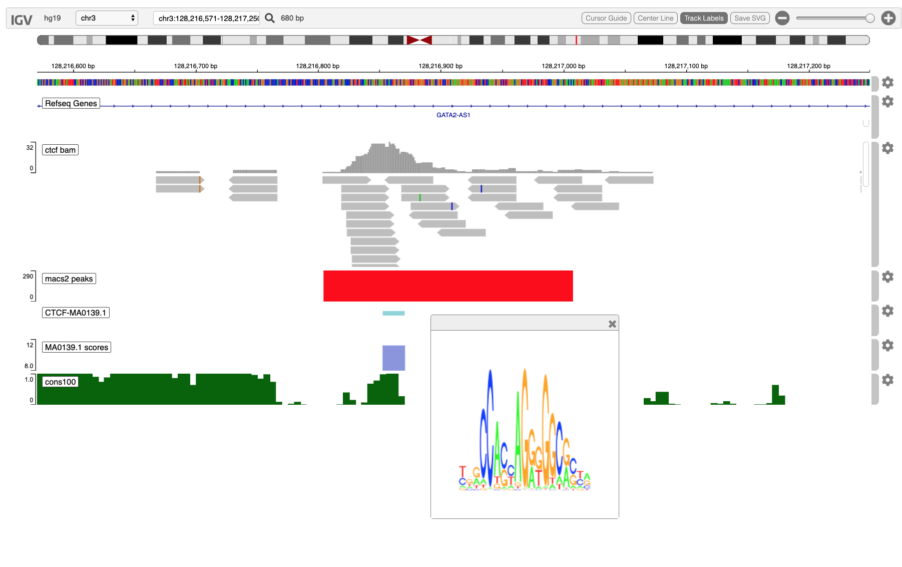

<style>
.main-container { width: 1200px; max-width:2800px;}
</style>


```{r setup, include = FALSE}
options(width=120)
knitr::opts_chunk$set(
   collapse = TRUE,
   eval=interactive(),
   echo=TRUE,
   comment = "#>"
)
```

# Overview

The igvR package provides easy programmatic access in R to the web-based javascript library
[igv.js](https://github.com/igvteam/igv.js).  R's access to data, and operations upon data,
are complemented by igv's richly interactive web browser interface to display and explore genomic
and epigentic data.

In this vignette we present a somewhat contrived ChIP-seq study - contrived in that it is not
organized around an actual research problem.   Instead, this vignette demonstrates methods
you would likely use to do visual QC and exploratory data analysis a ChIP-seq experiment.

We begin with ENCODE data of CTCF binding on chromosome 3, on the hg19 reference genome, in the vicinity
of the GATA2 gene.   We will

  - display a 252 kb region of that genome
  - load and display a GenomicAlignments object from an indexed bam file covering that region
  - load and display a narrow peaks bedGraph track, precalculated by MACS2
  - Use the Biostrings::matchPWM method to identify regions in the displayed sequence which,
    with at least 80% fidelity, match the CTCF motif, Jaspar 2018's MA0138.1, from MotifDb
  - Display that motif logo in a browser popup.
  - load sequence conservation data from the Bioconductor annotation package phastCons100way.UCSC.hg19,
    looking for the intersection of ChIP peaks, motif match and conserved sequence, all
    of which together suggest that at such locations functional TF binding occurs.
    
This screenshot illustrates the final state of igv in your browser at the conclusion
of the code found below.

```{r, eval=TRUE, echo=FALSE}

```

# Load the libraries we need

```{r loadLibraries,  results='hide'}
library(igvR)
library(MotifDb)
library(BSgenome.Hsapiens.UCSC.hg19)
library(phastCons100way.UCSC.hg19)

```

Create the igvR instance, with all default parameters (portRange, quiet, title).  Javascript and HTML is loaded into
your browser, igv.js is initialized, a websocket connection between your R process and that web page is constructed,
over which subsequent commands and data will travel.

```{r createLoad, results='hide'}
igv <- igvR()
setBrowserWindowTitle(igv, "CTCF ChIP-seq")
setGenome(igv, "hg19")
```
Display 1.4MB on chr3 more or less centered on the GATA2 genes
```{r initialDisplay,  results='hide'}
showGenomicRegion(igv, "chr3:128,079,020-128,331,275")
```

# Create a GRanges object specifying our region of interest, obtaining a list (chrom, start, end, string) from igv

```{r roi,  results='hide'}
loc <- getGenomicRegion(igv)
which <- with(loc, GRanges(seqnames=chrom, ranges = IRanges(start, end)))
param <- ScanBamParam(which=which, what = scanBamWhat())
bamFile <- "~/github/ChIPseqMotifMatch/bulk/GSM749704/GSM749704_hg19_wgEncodeUwTfbsGm12878CtcfStdAlnRep1.bam"
file.exists(bamFile)
x <- readGAlignments(bamFile, use.names=TRUE, param=param)
track <- GenomicAlignmentTrack("ctcf bam", x, visibilityWindow=10000000, trackHeight=200)  # 30000 default
displayTrack(igv, track)
```

# Load narrow peaks previously called by MACS2 from the bam file

We previously ran MACS2 using docker and make, with this makefile, an approach that you may find useful
but which requires that you install Docker and the Macs2 image.  The resulting narrow peaks file
is includes in the package.

Macs2 narrowpeaks produce one possible summary and reduction of the bam pileup, though
the bam track histogram is arguably more informative.


```
DATADIR=/Users/paul/github/igvR/vignettes/macs2
BAM=GSM749704_hg19_wgEncodeUwTfbsGm12878CtcfStdAlnRep1.bam
NAME=GSM749704_hg19_chr19
run:
	docker run -v $(DATADIR):/data/ fooliu/macs2 callpeak -t /data/$(BAM) -n $(NAME) --outdir data/
```

This produces several files; we are interested only in the narrow peaks:

```{r narrow.peaks.track,  results='hide'}
filename <- system.file(package="igvR", "extdata", "GSM749704_hg19_chr19_peaks.narrowPeak")
tbl.pk <- get(load(system.file(package="igvR", "extdata", "GSM749704_hg19_chr19_subset.RData")))
track <- DataFrameQuantitativeTrack("macs2 peaks", tbl.pk, color="red", autoscale=TRUE)
displayTrack(igv, track)
```

# Match the CTCF motif against sequence in the currently displayed region

```{r prepare.for.motif.match.and.display, results='hide'}

dna <- with(loc, getSeq(BSgenome.Hsapiens.UCSC.hg19, chrom, start, end))
pfm.ctcf <- query(MotifDb, c("CTCF", "sapiens", "jaspar2018"), notStrings="ctcfl")
motif.name <- names(pfm.ctcf)[1]
pfm <- pfm.ctcf[[1]]
```

# Use matchPWM from the Biostrings package to match the motif on both strands

We use a lenient match threshold reflecting our view that TF binding is often quite permissive and inexact.


```{r motif.match, results='hide'}
hits.forward <- matchPWM(pfm, as.character(dna), with.score=TRUE, min.score="80%")
hits.reverse <- matchPWM(reverseComplement(pfm), as.character(dna), with.score=TRUE, min.score="80%")

tbl.forward <- as.data.frame(ranges(hits.forward))
tbl.reverse <- as.data.frame(ranges(hits.reverse))
tbl.forward$score <- mcols(hits.forward)$score
tbl.reverse$score <- mcols(hits.reverse)$score

tbl.matches <- rbind(tbl.forward, tbl.reverse)


tbl.matches$chrom <- loc$chrom
tbl.matches$start <- tbl.matches$start + loc$start
tbl.matches$end <- tbl.matches$end + loc$start
```

# Set up motif logo viewing

It can be useful to view the logo of the matched motif in context.  igvR supports this with
(at present) a little preparation:

  1. tell igvR you wish to use this capability
  2. add a recognizable "MotifDb::" protocol string to the motif name in the annotation track

With this option enabled, and with the name (or label) field of an annotation bed data.frame carrying the prefix
*MotifDb://*, then clicking on the motif element in _CTCF_MA0139.1_ track, the corresponding motif will be displayed
in a popup window.   This is especially useful when your display has tracks for multiple motifs.

```{r prepare.motif.popup, results='hide'}
enableMotifLogoPopups(igv)

tbl.matches$name <- paste0("MotifDb::", motif.name)
tbl.matches <- tbl.matches[, c("chrom", "start", "end", "name", "score")]
dim(tbl.matches)
```
# Render the motif matching in two way, using two tracks: one for annotation, one for score

In *igvR* we distinguish between _annotation_ tracks, _quantitative_ tracks, and _other_ tracks (sucs as VCF and bam).
Annotation tracks are a representation of the  BED format.  Quantitative tracks represent the WIG format.

In brief: imagine you have a data.frame with these five columns:

 1. chrom
 2. start
 3. end
 4. name
 5. score

Construct a DataFrameAnnotationTrack with columns 1-4.

Construct a DataFrameQuantitativeTrack with columns 1,2,3,5.

If the name (fourth) column contains the name of a MotifDb entry
(e.g.,  "Hsapiens-jaspar2018-CTCF-MA0139.1") then prepend "MotifDb://" to support the
motif logo popup.


```{r display.both.annotation.and.quantitative.tracks, results='hide'}
track <- DataFrameAnnotationTrack("CTCF-MA0139.1", tbl.matches[, 1:4], color="random")
displayTrack(igv, track)

track <- DataFrameQuantitativeTrack("MA0139.1 scores", tbl.matches[, c(1,2,3,5)], color="random", autoscale=FALSE, min=8, max=12)
displayTrack(igv, track)

```

# Is there any reason to believe these motif matches are functional?

Motifs match to DNA sequence with great frequency, especially when (as above), a relaxed motif matching
threshold is used.  There are, however, three factors which increase the likelihood that the matches identify
functional binding sites:

  1. They are found in or near a high-confidence ChIP-seq site
  2. The DNA sequence is highly conserved across species and time
  3. The sequence is found in a known regulatory region associated with the target gene (here GATA2)

The first factor can be see from direct inspection in the browser.  For the second, let's add
the phastCons100way genome track, a Bioconductor annotation package which represents conserved sequence
across 100 species over  millions of years.

To obtain  a fine-grained assessment of conservation, we use bins which are shorter than
motifs.  So here we add a conservation track which displays the conservation of every 5-base pair block.
Conservation is scored between 0 and 1.

```{r motif.match.and.display, results='hide'}
loc <- getGenomicRegion(igv)
starts <- with(loc, seq(start, end, by=5))
ends <- starts + 5
count <- length(starts)
tbl.blocks <- data.frame(chrom=rep(loc$chrom, count), start=starts, end=ends, stringsAsFactors=FALSE)
dim(tbl.blocks)

tbl.cons100 <- as.data.frame(gscores(phastCons100way.UCSC.hg19, GRanges(tbl.blocks)), stringsAsFactors=FALSE)
tbl.cons100$chrom <- as.character(tbl.cons100$seqnames)
tbl.cons100 <- tbl.cons100[, c("chrom", "start", "end", "default")]
track <- DataFrameQuantitativeTrack("cons100", tbl.cons100, autoscale=TRUE, color="darkgreen")
displayTrack(igv, track)
```

```{r zoom.in, results='hide'}
showGenomicRegion(igv, "chr3:128,216,695-128,217,110")
```
# Some tentative conclusions
The large ChIP-seq peak located in the middle of the large intron of GATA2-AS1 is centered
on a good match to the CTCF Jaspar 2018 motif, and most of that sequence match intersects with
highly conserved DNA.  The co-occurrence of these three features suggests that this location
is likely to be a functional binding site for CTCF.  

# Session Info

```{r sessionInfo}
sessionInfo()
````

