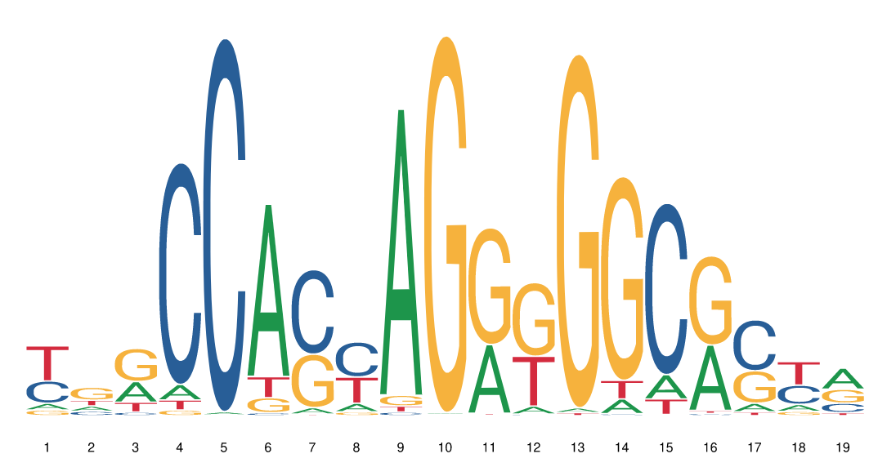
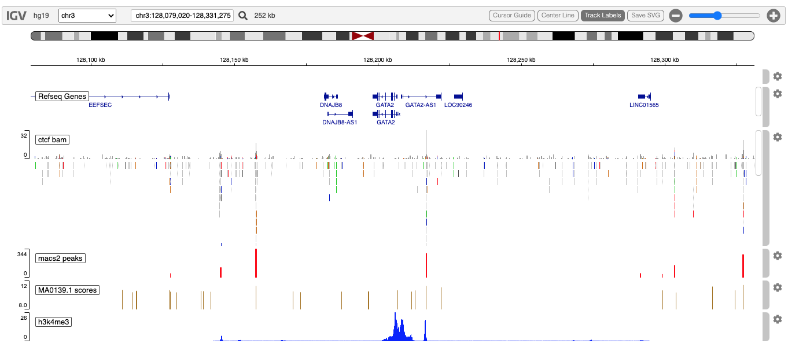

<style>
.main-container { width: 1200px; max-width:2800px;}
</style>


```{r setup, include = FALSE}
options(width=120)
knitr::opts_chunk$set(
   collapse = TRUE,
   eval=interactive(),
   echo=TRUE,
   comment = "#>"
)
```


# Overview

The igvR package provides easy programmatic access in R to the web-based javascript library
[igv.js](https://github.com/igvteam/igv.js).  R's access to data, and operations upon data,
are complemented by igv's richly interactive web browser interface to display and explore genomic
and epigentic data.

In this vignette we present a somewhat contrived ChIP-seq study - contrived in that it is not
organized around an actual research problem.   Instead, this vignette demonstrates methods
you would likely use to do visual QC and exploratory data analysis of ChIP-seq data, for CTCF,
a [protein which plays multiple roles in gene regulation](https://www.nature.com/articles/emm201533#:~:text=CCCTC%2Dbinding%20factor%20(CTCF),communication%20between%20enhancers%20and%20promoters)
in the vicinity of a gene of interest, GATA2.

We begin with ENCODE data of CTCF binding on chromosome 3, on the hg19 reference genome, in the vicinity
of the GATA2 gene.   We will

  - Display a 252 kb region of that genome
  - Read the indexed bam file into a GenomicAlignments object covering that region, and display it
  - Load and display a narrow peaks bedGraph track, precalculated by MACS2 processing of the bam file
  - Use the Biostrings::matchPWM method to identify regions in the displayed sequence which,
    with at least 80% fidelity, match the CTCF motif, Jaspar 2018's MA0138.1, from MotifDb
  - Display those scored motif matches
  - Load and display H3K4me3 histone marks from a bigwig file
  - Zoom in on a likely functional CTCF binding site downstream of GATA2, as suggested by
    these combined data

# Initialize igvR

```{r eval=FALSE}
library(igvR)
igv <- igvR()
setBrowserWindowTitle(igv, "CTCF ChIP-seq")
setGenome(igv, "hg19")
showGenomicRegion(igv, "chr3:128,079,020-128,331,275")
   # or
showGenomicRegion(igv, "GATA2")
for(i in 1:4) zoomOut(igv)
```
```{r, eval=TRUE, echo=FALSE}
knitr::include_graphics("images/ctcfBam-01.png")
```


# Load alignments for the currently displayed genomic region

A modest but often useful feature of igvR is R access to the currently displayed genomic
region.  In the previous step we showed to ways to set the region programatically from R.
This may not get you exactly the region you are interested in, so interactive adjustment
in the browser can fine tune your region of interest ("roi").  Once that is set, retrieve
the roi, create a GRanges object from it to use to read only the relevant slice of the bam file.

```{r eval=FALSE}
roi <- getGenomicRegion(igv)
gr.roi <- with(roi, GRanges(seqnames=chrom, ranges = IRanges(start, end)))
param <- ScanBamParam(which=gr.roi, what = scanBamWhat())
bamFile <- system.file(package="igvR", "extdata", "ctcf-gata2", "gata2-region-hg19.bam")
alignments <- readGAlignments(bamFile, use.names=TRUE, param=param)
```

# Display the alignment

igvR provides a number of tracks, each with a constructor, each which then is displayed in igv
with the same general purpose function.  These are some of the currently supported tracks:

 - BedpeInteractionsTrack
 - DataFrameAnnotationTrack
 - DataFrameQuantitativeTrack
 - GFF3Track
 - GRangesAnnotationTrack
 - GRangesQuantitativeTrack
 - GWASTrack
 - GWASUrlTrack
 - GenomicAlignmentTrack
 - RemoteAlignmentTrack
 - CramTrack
 - UCSCBedAnnotationTrack
 - UCSCBedGraphQuantitativeTrack
 - VariantTrack

```{r eval=FALSE}
track <- GenomicAlignmentTrack(trackName="ctcf bam", alignments, visibilityWindow=10000000, trackHeight=200) 
displayTrack(igv, track)
```

```{r, eval=TRUE, echo=FALSE}
knitr::include_graphics("images/ctcfBam-02.png")
```

# Narrow Peaks from MACS

[MACS](https://github.com/macs3-project/MACS) is a popular peak-caller, summarizing
piled-up DNA reads into narrow peaks.  This operation sacrifices detail, and is subject to
run-time parameterization choices, but is nonetheless quite useful.  By examinging these
narrow peaks and the raw reads together in igvR, the benefits of detail and summary are
both achieved.

The *DataFrameQuantitativeTrack* requires a data.frame with the columns and classes
shown here:
```{r eval=FALSE}
lapply(tbl.pk, class)
head(tbl.pk)

constructed from a data.frame.  


```{r eval=FALSE}
narrowPeaksFile <- system.file(package="igvR", "extdata", "ctcf-gata2",
                               "gata2-region-macs2-narrowPeaks.RData")
tbl.pk <- get(load(narrowPeaksFile))
dim(tbl.pk) # 109 4
head(tbl.pk)
  #      chrom     start       end score
  # 6381 chr10 127910682 127910864    27
  # 6382 chr10 128075644 128075811    89
  # 6383 chr10 128259852 128259984    27
  # 6384 chr10 128286655 128286920    78
  # 6385 chr10 128437706 128437938    89
  # 8827 chr11 127965327 127965489    70

unlist(lapply(tbl.pk, class))
#        chrom       start         end       score 
#  "character"   "integer"   "integer"   "integer" 

track <- DataFrameQuantitativeTrack("macs2 peaks", tbl.pk, color="red", autoscale=TRUE)
displayTrack(igv, track)

```

```{r, eval=TRUE, echo=FALSE}
knitr::include_graphics("images/ctcfBam-03.png")
```

# Motif Matching

Transcription factor binding sites are often characterized by sequence match to
the TF's curated motif.   We will use this motif from [JASPAR 2022](https://jaspar.genereg.net/matrix/MA0139.1/)
and identify matches in the hg19 genome in our region of interest.

```{r, out.width="500px", eval=TRUE, echo=FALSE}

```
```{r eval=FALSE}
   # get the DNA sequence in the current region
dna <- with(roi, getSeq(BSgenome.Hsapiens.UCSC.hg19, chrom, start, end))
   # get the first of three motifs for CTCF.  (a more thorough study would use all three)
pfm.ctcf <- MotifDb::query(MotifDb, c("CTCF", "sapiens", "jaspar2022"), notStrings="ctcfl")
motif.name <- names(pfm.ctcf)[1]
pfm <- pfm.ctcf[[1]]

   # Find matches >= 80% of this motif in the sequence.  create a suitable 
   # data.frame for another DataFrameQuantitativeTrack

hits.forward <- matchPWM(pfm, as.character(dna), with.score=TRUE, min.score="80%")
hits.reverse <- matchPWM(reverseComplement(pfm), as.character(dna), with.score=TRUE, min.score="80%")

tbl.forward <- as.data.frame(ranges(hits.forward))
tbl.reverse <- as.data.frame(ranges(hits.reverse))
tbl.forward$score <- mcols(hits.forward)$score
tbl.reverse$score <- mcols(hits.reverse)$score

tbl.matches <- rbind(tbl.forward, tbl.reverse)
tbl.matches$chrom <- roi$chrom
tbl.matches$start <- tbl.matches$start + roi$start

tbl.matches$end <- tbl.matches$end + roi$start

tbl.matches$name <- paste0("MotifDb::", motif.name)
tbl.matches <- tbl.matches[, c("chrom", "start", "end", "name", "score")]
dim(tbl.matches) # 25 5
head(tbl.matches)
    #   chrom     start       end                                       name    score
    # 1  chr3 128110910 128110928 MotifDb::Hsapiens-jaspar2018-CTCF-MA0139.1 10.70369
    # 2  chr3 128114573 128114591 MotifDb::Hsapiens-jaspar2018-CTCF-MA0139.1 10.36891
    # 3  chr3 128127658 128127676 MotifDb::Hsapiens-jaspar2018-CTCF-MA0139.1 10.44666
    # 4  chr3 128138376 128138394 MotifDb::Hsapiens-jaspar2018-CTCF-MA0139.1 10.54861
    # 5  chr3 128139280 128139298 MotifDb::Hsapiens-jaspar2018-CTCF-MA0139.1 10.51689
    # 6  chr3 128173128 128173146 MotifDb::Hsapiens-jaspar2018-CTCF-MA0139.1 10.37987

```
# Display the Matches

This will show that there are many more potential binding sites, based on sequence alone,
that is indicated by ChIP.

```{r eval=FALSE}
track <- DataFrameQuantitativeTrack("MA0139.1 scores", tbl.matches[, c(1,2,3,5)],
                                    color="random", autoscale=FALSE, min=8, max=12)
displayTrack(igv, track)
```

```{r, eval=TRUE, echo=FALSE}
knitr::include_graphics("images/ctcfBam-04.png")
```


# H3K4Me3 Histone Marks
Methylation at the 4th lysine of histone H3 can correlate with transcrition factor binding nearby.
Here we read and load an H3k4Me3 track from the same [GM12878](https://www.ncbi.nlm.nih.gov/geo/query/acc.cgi?acc=GSM749704)
lymphoblastoid cells from which the CTCF ChIP-seq was obtained.

The Bioconductor AnnotationHub is one possible source for this H3K4Me3 data.  We obtained this
track, *AH40294 | E116-H3K4me3.imputed.pval.signal.bigwig*, and then for convenience
sliced out a region of intererest and saved as a bigwig file in extdata/ctcf-gata2 directory of
the igvR package.

We use here the *GRangesQuantitativeTrack*, which is very like the *DataFrameQuantitativeTrack*
used above, but specialized for GRanges rather than bed-like data.frames.

```{r eval=FALSE}

roi <- getGenomicRegion(igv)
bigwig.file <- system.file(package="igvR", "extdata", "ctcf-gata2", "gata2-region-h3k4me3.bw")

bw.slice <- import(bigwig.file, which=gr.roi)
track <- GRangesQuantitativeTrack("h3k4me3", bw.slice, autoscale=TRUE)
displayTrack(igv, track)

```

```{r, eval=TRUE, echo=FALSE}

```

# Zoom in to one interesting, and  possibly functional CTCF binding site

This is most easily, and most naturally accomplished with your mouse in the web browser,
by dragging a region in the spece between the cytoband and the sequence ruler,
producing the zoomed in view which can also be obtained programmatically:
```{r eval=FALSE}
showGenomicRegion(igv, "chr3:128,202,505-128,222,868")
```
You can see that the ChIP-seq evidence supports CTCF binding, with additional support from
motif match and H3K4Me3.   There is no ChIP-seq support for the upstream site, despite
motif match and H3K4Me3 binding.

```{r, eval=TRUE, echo=FALSE}
knitr::include_graphics("images/ctcfBam-07.png")
```

<!--
  # Session Info
  
  ```{r eval=TRUE}
  sessionInfo()
  ```
-->  
  
