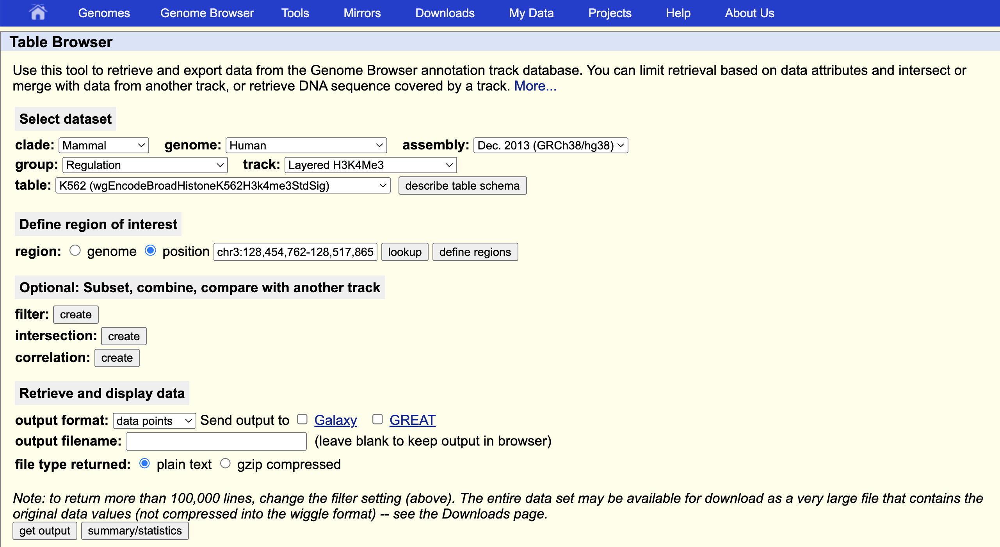
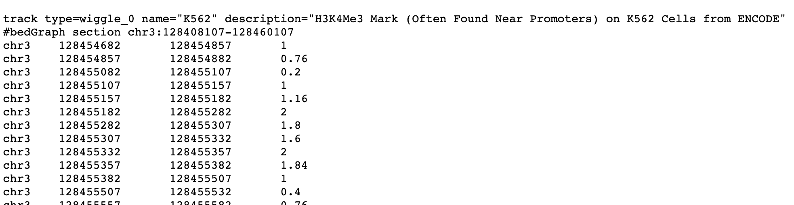
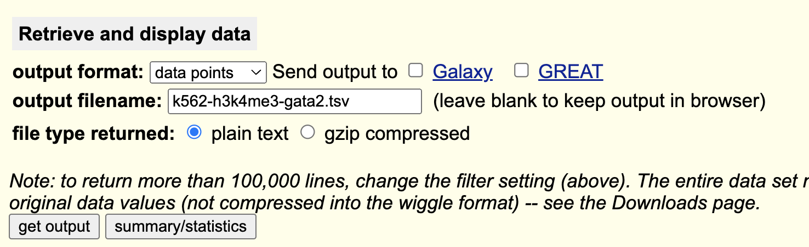
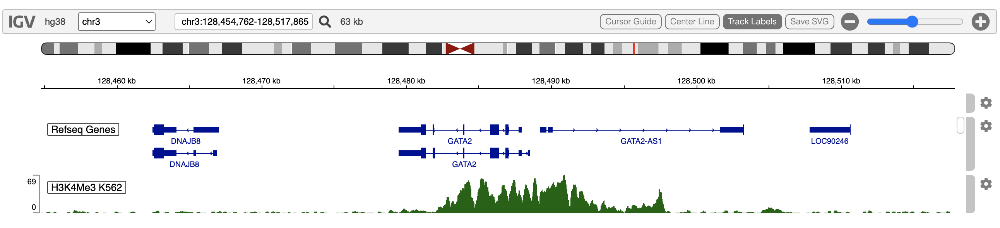

<style>
.main-container { width: 1000px; max-width:2800px;}
</style>


```{r setup, include = FALSE}
options(width=120)
knitr::opts_chunk$set(
   collapse = TRUE,
   eval=interactive(),
   echo=TRUE,
   comment = "#>"
)
```


# Overview

The UCSC Table Browser is a good source of genomic annotations of many different kinds.
It has a clear, easily navigated user interface.  It is a good complement to igvR.

The H3K4Me3 post-translational modification is frequently found in
active promoters near transcription start sites.  Here we obtain
H3K4Me3 methylation marks in K562 cells in and around GATA2.


These are the steps involved:

1. in igvR, display a genomic region of interest
2. use your mouse to copy the resulting  **chrom:start-end** genomic region string
3. in the Table Browser, select your genome and dataset of interest
4. paste the genomic region string into the UCSC Table Browser
5. click **get output** to examine the specified data
6. once you are satisfied that the data are of interest, fill in the **output filename** and save to a local tsv file
7. back in R, use read.table to create a data.frame from that file
8. construct and display an igvR DataFrameAnnotationTrack or DataFrameQuantitativeTrack

All these steps are shown below.
 
# Display a genomic region of interest in igvR

```{r eval=FALSE}
library(igvR)
igv <- igvR()
setBrowserWindowTitle(igv, "H3K4Me3 GATA2")
setGenome(igv, "hg38")
showGenomicRegion(igv, "GATA2")
zoomOut(igv)
zoomOut(igv)
```

```{r, eval=TRUE, echo=FALSE, out.width="95%"}
knitr::include_graphics("images/gata2-63kb.png")
```

# Obtain the coordinates

```{r eval=FALSE}
getGenomicRegion(igv)
```

```
$chrom
[1] "chr3"

$start
[1] 128454762

$end
[1] 128517865

$width
[1] 63104

$string
[1] "chr3:128,454,762-128,517,865"
```

# Navigate the Table Browser

Use this URL:  **https://genome.ucsc.edu/cgi-bin/hgTables**

Copy and past the region string into the UCSC Table Browser **position** field.
Make other selections as shown.


```{r, eval=TRUE, echo=FALSE, out.width="95%"}

```

# Examine the Data
With the **output filename** blank, the **get output** button shows you the selected data as text in your web browser:

```{r, eval=TRUE, echo=FALSE, out.width="95%"}

```

# Download the Data

Return to the previous UCSC Table Browser Screen, fill in a download filename, click **get output**

```{r, eval=TRUE, echo=FALSE, out.width="95%"}

```

# Read the data into R

```{r eval=FALSE}
tbl <- read.table("~/drop/k562-h3k4me3-gata2.tsv", sep="\t", skip=1, as.is=TRUE, fill=TRUE)
colnames(tbl) <- c("chrom", "start", "end", "score")
```
Make sure the column classes are as expected:
```{r eval=FALSE}
lapply(tbl, class)
```

```
$chrom
[1] "character"

$start
[1] "integer"

$end
[1] "integer"

$score
[1] "numeric"
```

# Create and Display a Quantitative Track

```{r eval=FALSE}
track <- DataFrameQuantitativeTrack("H3K4Me3 K562", tbl, autoscale=TRUE, color="darkGreen")
displayTrack(igv, track)
```

```{r, eval=TRUE, echo=FALSE, out.width="95%"}

```


# Session Info

```{r eval=TRUE}
sessionInfo()
```

